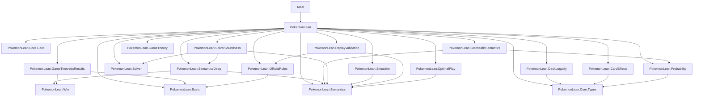

# PokemonLean Architecture

This document reflects the current checked-in Lean module graph and metrics.

## Current structure snapshot

- Root modules: `Main`, `PokemonLean`
- Core modules: `PokemonLean.Core.Card`, `PokemonLean.Core.Types`
- Feature modules: 63 modules under `PokemonLean/*`

### Feature module set

`PokemonLean.ACESpec`, `PokemonLean.Abilities`, `PokemonLean.AbilitySystem`, `PokemonLean.AncientTrait`, `PokemonLean.ArchetypeMatchups`, `PokemonLean.Archetypes`, `PokemonLean.Basic`, `PokemonLean.BoardState`, `PokemonLean.CardEffects`, `PokemonLean.CardPool`, `PokemonLean.Cards`, `PokemonLean.Corpus`, `PokemonLean.DamageCounters`, `PokemonLean.Deck`, `PokemonLean.DeckBuilding`, `PokemonLean.DeckConstraints`, `PokemonLean.DeckLegality`, `PokemonLean.Decks`, `PokemonLean.EnergyAcceleration`, `PokemonLean.EnergyManagement`, `PokemonLean.Evolution`, `PokemonLean.Format`, `PokemonLean.GXAttacks`, `PokemonLean.GameTheoreticResults`, `PokemonLean.GameTheory`, `PokemonLean.HandDisruption`, `PokemonLean.HandManagement`, `PokemonLean.LostZone`, `PokemonLean.LostZoneBox`, `PokemonLean.LostZoneCombos`, `PokemonLean.LostZoneThresholds`, `PokemonLean.Matchup`, `PokemonLean.MixedStrategy`, `PokemonLean.Mulligan`, `PokemonLean.OfficialRules`, `PokemonLean.OptimalPlay`, `PokemonLean.Planner`, `PokemonLean.PrizeCards`, `PokemonLean.PrizeDenial`, `PokemonLean.Prizes`, `PokemonLean.Probability`, `PokemonLean.Replay`, `PokemonLean.ReplayValidation`, `PokemonLean.RetreatMechanics`, `PokemonLean.Rotation`, `PokemonLean.Semantics`, `PokemonLean.SemanticsDeep`, `PokemonLean.Simulator`, `PokemonLean.Solver`, `PokemonLean.SolverSoundness`, `PokemonLean.SpecialConditions`, `PokemonLean.Stadium`, `PokemonLean.StatusEffects`, `PokemonLean.StochasticSemantics`, `PokemonLean.Switching`, `PokemonLean.Tournament`, `PokemonLean.TournamentRules`, `PokemonLean.TrainerCards`, `PokemonLean.TrainerSystem`, `PokemonLean.TurnStructure`, `PokemonLean.TypeChart`, `PokemonLean.VSTAR`, `PokemonLean.Win`

## Metrics

| Scope | Files | Lines of code | Theorems | Definitions (`def`) |
|---|---:|---:|---:|---:|
| Total | 67 | 27,071 | 1,927 | 1,106 |
| Root | 2 | 120 | 0 | 1 |
| PokemonLean.Core | 2 | 590 | 6 | 18 |
| PokemonLean | 63 | 26,361 | 1,921 | 1,087 |

## New module descriptions

| Module | Description | Representative theorem(s) |
|---|---|---|
| `PokemonLean.SemanticsDeep` | Metatheory for deterministic step semantics with progress and termination. | `progress`, `game_terminates` |
| `PokemonLean.Probability` | Finite distributions and expected-value lemmas for coin-flip attacks. | `expectedValue_coinFlip`, `tripleCoin_expectedDamage` |
| `PokemonLean.CardEffects` | Formal state transitions for iconic card effects with conservation proofs. | `bossesOrders_conserves_cards`, `switch_conserves_cards` |
| `PokemonLean.SolverSoundness` | Connects solver outputs to legal semantic transitions and optimality guarantees. | `solve_legal`, `solve_complete_lethal` |
| `PokemonLean.StochasticSemantics` | Probability-lifted transition semantics preserving invariants. | `stepProb_card_conservation`, `stepProb_win_monotonic` |
| `PokemonLean.OfficialRules` | Official rule constraints for turns, evolution, supporter/energy limits, and prize taking. | `no_evo_first_turn`, `spent_turn` |
| `PokemonLean.GameTheoreticResults` | Prize-race/tempo/game-length theorems linked to gameplay semantics. | `prize_trade_winner`, `first_player_advantage_bound` |
| `PokemonLean.DeckLegality` | Decidable 60-card legality checker with banned-card and copy-limit constraints. | `checkDeckLegal_sound`, `checkDeckLegal_iff` |
| `PokemonLean.Simulator` | Strategy-driven game simulation with reachability and invariant guarantees. | `simulation_validity`, `simulateState_preserves_card_conservation` |
| `PokemonLean.OptimalPlay` | Micro-format minimax analysis for first-player and OHKO dominance criteria. | `optimal_strategy_exists`, `first_player_wins_iff` |
| `PokemonLean.ReplayValidation` | Replay checker proving executable validator equivalence with legality relation. | `validateReplay_eq_true_iff_replayValid`, `REPLAY_WIN_DETECTION` |

## Requested-module existence check

| Requested module | Exists in `PokemonLean/` |
|---|---|
| `SemanticsDeep` | yes |
| `Probability` | yes |
| `CardEffects` | yes |
| `SolverSoundness` | yes |
| `StochasticSemantics` | yes |
| `OfficialRules` | yes |
| `GameTheoreticResults` | yes |
| `DeckLegality` | yes |
| `Simulator` | yes |
| `OptimalPlay` | yes |
| `ReplayValidation` | yes |
| `NashEquilibrium` | no |

## Import graph

## Root import set (`PokemonLean.lean`)

`PokemonLean.Core.Types`, `PokemonLean.Core.Card`, `PokemonLean.Basic`, `PokemonLean.Cards`, `PokemonLean.CardEffects`, `PokemonLean.Corpus`, `PokemonLean.Solver`, `PokemonLean.SolverSoundness`, `PokemonLean.GameTheory`, `PokemonLean.GameTheoreticResults`, `PokemonLean.OptimalPlay`, `PokemonLean.Semantics`, `PokemonLean.SemanticsDeep`, `PokemonLean.Simulator`, `PokemonLean.BoardState`, `PokemonLean.DamageCounters`, `PokemonLean.Matchup`, `PokemonLean.TrainerSystem`, `PokemonLean.DeckBuilding`, `PokemonLean.ACESpec`, `PokemonLean.Win`, `PokemonLean.Planner`, `PokemonLean.Switching`, `PokemonLean.Rotation`, `PokemonLean.Format`, `PokemonLean.Abilities`, `PokemonLean.Decks`, `PokemonLean.Prizes`, `PokemonLean.StatusEffects`, `PokemonLean.TypeChart`, `PokemonLean.EnergyManagement`, `PokemonLean.EnergyAcceleration`, `PokemonLean.Replay`, `PokemonLean.ReplayValidation`, `PokemonLean.Stadium`, `PokemonLean.LostZone`, `PokemonLean.LostZoneThresholds`, `PokemonLean.LostZoneBox`, `PokemonLean.LostZoneCombos`, `PokemonLean.TournamentRules`, `PokemonLean.OfficialRules`, `PokemonLean.HandManagement`, `PokemonLean.Archetypes`, `PokemonLean.ArchetypeMatchups`, `PokemonLean.RetreatMechanics`, `PokemonLean.HandDisruption`, `PokemonLean.PrizeDenial`, `PokemonLean.TurnStructure`, `PokemonLean.DeckConstraints`, `PokemonLean.DeckLegality`, `PokemonLean.GXAttacks`, `PokemonLean.Probability`, `PokemonLean.AbilitySystem`, `PokemonLean.AncientTrait`, `PokemonLean.CardPool`, `PokemonLean.Evolution`, `PokemonLean.MixedStrategy`, `PokemonLean.Mulligan`, `PokemonLean.PrizeCards`, `PokemonLean.SpecialConditions`, `PokemonLean.TrainerCards`, `PokemonLean.VSTAR`, `PokemonLean.Deck`, `PokemonLean.Tournament`, `PokemonLean.StochasticSemantics`
