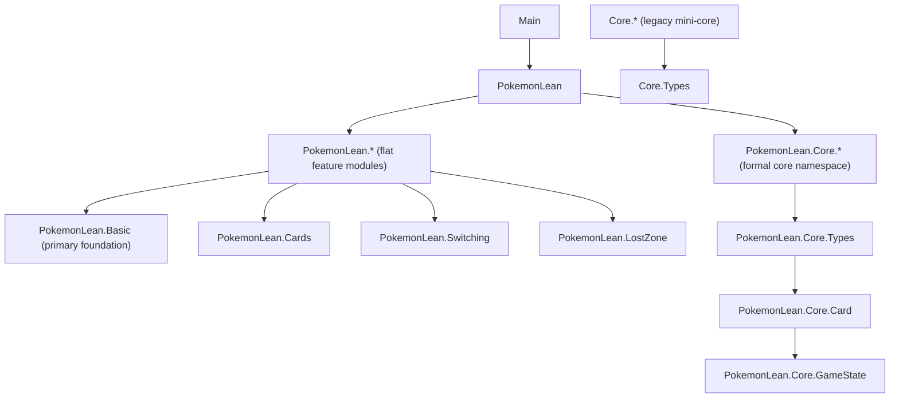

# PokemonLean Architecture

This document summarizes the architecture of the Lean codebase by analyzing all `.lean` files in this repository (`115` modules under root, `Core/`, and `PokemonLean/`).

## 1) Module dependency graph

### 1.1 High-level graph



### 1.2 Namespace-level structure

- **Root modules (3):** `Main`, `PokemonLean`, `lakefile`
- **Legacy core (7):** `Core.*`
- **Flat feature layer (52):** `PokemonLean.*` (excluding `PokemonLean.Core.*`)
- **Formal core namespace (53):** `PokemonLean.Core.*`

### 1.3 Internal import adjacency (project modules only)

- `Core.BenchLimits` -> `Core.Types`
- `Core.BenchProtection` -> `Core.Types`
- `Core.BoardPositioning` -> `Core.Types`
- `Core.ConditionRemoval` -> `Core.SpecialConditions`, `Core.Types`
- `Core.ConditionStrategy` -> `Core.ConditionRemoval`, `Core.SpecialConditions`, `Core.Types`
- `Core.SpecialConditions` -> `Core.Types`
- `Main` -> `PokemonLean`
- `PokemonLean` -> (library root; imports all major `PokemonLean.*` and `PokemonLean.Core.*` modules)
- `PokemonLean.ACESpec` -> `PokemonLean.DeckBuilding`
- `PokemonLean.Abilities` -> `PokemonLean.Basic`
- `PokemonLean.AbilitySystem` -> `PokemonLean.Basic`
- `PokemonLean.AncientTrait` -> `PokemonLean.Basic`
- `PokemonLean.ArchetypeMatchups` -> `PokemonLean.Archetypes`
- `PokemonLean.Archetypes` -> `PokemonLean.Basic`
- `PokemonLean.BoardState` -> `PokemonLean.Basic`
- `PokemonLean.CardPool` -> `PokemonLean.Basic`
- `PokemonLean.Cards` -> `PokemonLean.Basic`
- `PokemonLean.Corpus` -> `PokemonLean.Cards`
- `PokemonLean.DamageCounters` -> `PokemonLean.Basic`
- `PokemonLean.Deck` -> `PokemonLean.Basic`
- `PokemonLean.DeckBuilding` -> `PokemonLean.Basic`
- `PokemonLean.DeckConstraints` -> `PokemonLean.Basic`
- `PokemonLean.Decks` -> `PokemonLean.Basic`
- `PokemonLean.EnergyAcceleration` -> `PokemonLean.Basic`
- `PokemonLean.EnergyManagement` -> `PokemonLean.Basic`
- `PokemonLean.Evolution` -> `PokemonLean.Basic`
- `PokemonLean.Format` -> `PokemonLean.Basic`
- `PokemonLean.GXAttacks` -> `PokemonLean.Basic`
- `PokemonLean.GameTheory` -> `PokemonLean.Basic`
- `PokemonLean.HandDisruption` -> `PokemonLean.Basic`
- `PokemonLean.HandManagement` -> `PokemonLean.Basic`
- `PokemonLean.LostZone` -> `PokemonLean.Basic`, `PokemonLean.Switching`
- `PokemonLean.LostZoneBox` -> `PokemonLean.Basic`, `PokemonLean.LostZone`, `PokemonLean.LostZoneThresholds`
- `PokemonLean.LostZoneCombos` -> `PokemonLean.Basic`, `PokemonLean.LostZone`, `PokemonLean.LostZoneThresholds`
- `PokemonLean.LostZoneThresholds` -> `PokemonLean.Basic`, `PokemonLean.LostZone`
- `PokemonLean.Matchup` -> `PokemonLean.Basic`
- `PokemonLean.MixedStrategy` -> `PokemonLean.Basic`
- `PokemonLean.Mulligan` -> `PokemonLean.Basic`
- `PokemonLean.Planner` -> `PokemonLean.Basic`
- `PokemonLean.PrizeCards` -> `PokemonLean.Basic`
- `PokemonLean.PrizeDenial` -> `PokemonLean.Basic`
- `PokemonLean.Prizes` -> `PokemonLean.Basic`
- `PokemonLean.Replay` -> `PokemonLean.Basic`, `PokemonLean.Semantics`
- `PokemonLean.RetreatMechanics` -> `PokemonLean.Basic`
- `PokemonLean.Rotation` -> `PokemonLean.Basic`, `PokemonLean.Switching`
- `PokemonLean.Semantics` -> `PokemonLean.Basic`
- `PokemonLean.Solver` -> `PokemonLean.Basic`, `PokemonLean.Cards`
- `PokemonLean.SpecialConditions` -> `PokemonLean.Basic`
- `PokemonLean.Stadium` -> `PokemonLean.Basic`
- `PokemonLean.StatusEffects` -> `PokemonLean.Basic`
- `PokemonLean.Switching` -> `PokemonLean.Basic`
- `PokemonLean.Tournament` -> `PokemonLean.Basic`, `PokemonLean.Decks`
- `PokemonLean.TournamentRules` -> `PokemonLean.Basic`
- `PokemonLean.TrainerCards` -> `PokemonLean.Basic`, `PokemonLean.Switching`
- `PokemonLean.TrainerSystem` -> `PokemonLean.Basic`
- `PokemonLean.TurnStructure` -> `PokemonLean.Basic`
- `PokemonLean.TypeChart` -> `PokemonLean.Basic`
- `PokemonLean.VSTAR` -> `PokemonLean.Basic`
- `PokemonLean.Win` -> `PokemonLean.Basic`
- `PokemonLean.Core.Card` -> `PokemonLean.Core.Types`
- `PokemonLean.Core.GameState` -> `PokemonLean.Core.Card`
- Most other `PokemonLean.Core.*` modules are intentionally **self-contained** (no internal project-module imports), serving as focused formalizations/proof suites.

## 2) Core type hierarchy

There are three overlapping type layers in the repository.

### 2.1 Flat gameplay model (`PokemonLean.Basic`)

```
EnergyType
StatusCondition, Weather
AttackEffect
Attack
Weakness, Resistance
Card
PokemonInPlay
PlayerState
PlayerId
GameState
Effect, Action, TurnOneActions
```

Key relation chain:
- `Attack` references `EnergyType` and `AttackEffect`.
- `Card` contains `List Attack`, plus optional `Weakness`/`Resistance`.
- `PokemonInPlay` wraps a `Card` + mutable battle state (`damage`, `status`, `energy`).
- `PlayerState` groups zones (`deck`, `hand`, `bench`, `active`, `discard`, `prizes`).
- `GameState` is two `PlayerState`s + active player.

### 2.2 Formal core namespace (`PokemonLean.Core`)

`PokemonLean.Core.Types`:
- `PType`
- `EnergyType := typed PType | colorless`
- `EnergyCost`

`PokemonLean.Core.Card`:
- `Stage`, `RuleBox`, `AbilityKind`, `TrainerKind`
- `Attack`, `Ability`
- `PokemonCard`, `TrainerCard`
- `Card := pokemon PokemonCard | trainer TrainerCard | energy EnergyType Bool`

`PokemonLean.Core.GameState`:
- `Zone`, `SpecialCondition`, `ConditionSet`
- `ActiveSlot`, `BenchSlot`
- `PlayerState`
- `TurnPhase`
- `GameState`

This gives a clean type ladder:
`Types -> Card model -> GameState model`.

### 2.3 Legacy mini-core (`Core/`)

`Core.Types` provides an alternate compact domain (`EnergyType`, `CardType`, `Pokemon`, `BoardState`, etc.), with `Core.SpecialConditions`, `Core.ConditionRemoval`, and `Core.ConditionStrategy` extending it.

## 3) Equality design decisions (`DecidableEq`, `BEq`, `LawfulBEq`)

### 3.1 Why both `DecidableEq` and `BEq` appear everywhere

- `DecidableEq` supports proposition-level reasoning (`a = b`) and proof automation.
- `BEq` supports executable checks (`a == b`) used by game-state functions and filters.
- Many data types derive both to keep runtime and proof layers aligned.

### 3.2 Explicit `LawfulBEq` where equality reflection matters most

In `PokemonLean.Basic`:
- `EnergyType` and `Card` define:
  - `instance : BEq ... := decide (a = b)`
  - `instance : LawfulBEq ...`

This makes boolean equality provably faithful to propositional equality and enables clean conversions via:
- `of_decide_eq_true`
- `decide_eq_true`

### 3.3 Common bridge pattern

Across modules, computational predicates often use `decide (...)` to expose propositions as booleans (e.g., threshold checks, deck constraints, strategy predicates), then proofs bridge back using lemmas like:
- `decide_eq_true_eq`
- `of_decide_eq_true`

This is the central "executable spec + proof reflection" pattern in the project.

## 4) Proof strategy

The codebase follows a consistent tactic:

1. **Define executable functions first**  
   Functions are mostly total, pattern-match driven (`Bool`, `Option`, `Except`) and model concrete TCG mechanics directly.

2. **Prove local correctness/invariants immediately**  
   Each module includes theorem suites asserting behavior, bounds, and conservation properties.

3. **Use proof-by-computation for finite/discrete cases**  
   Frequent use of:
   - `rfl` for definitional equalities
   - `simp` / `simp only` for rewrite-driven proofs
   - `native_decide` for finite case closure
   - `omega` for arithmetic obligations
   - `cases` / `induction` on enums and lists

4. **Soundness/completeness pairs for algorithms**  
   Example pattern in `PokemonLean.Basic`:
   - executable checker (`energyCostSatisfied`)
   - constructive consumer (`consumeEnergyCost`)
   - theorems proving both directions and an iff bridge

5. **Regression-style theorem banks**  
   Many modules prove concrete scenario theorems (specific card/condition outcomes), effectively turning examples into machine-checked regression assertions.

Net result: each module is both a runnable rules model and a proof artifact, with minimal gap between implementation and verification.
